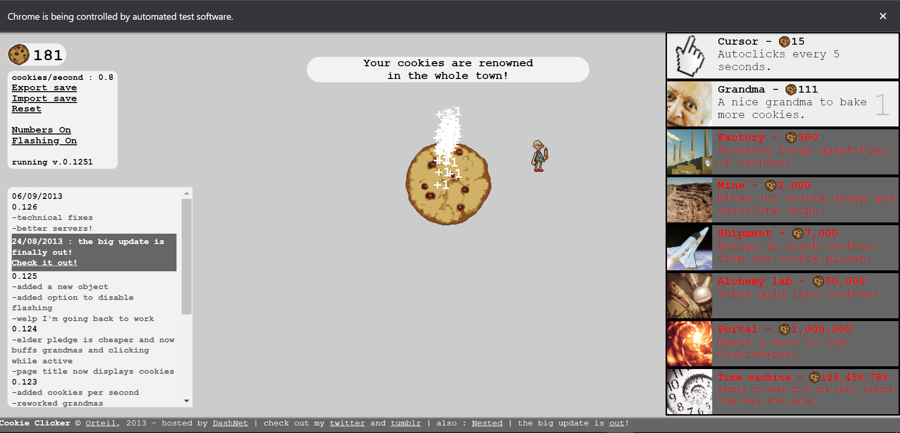

# Cookie Clicker Automation with Selenium!



This repository contains a Python script for automating the clicking process in the popular game Cookie Clicker using
the Selenium library. With this automation, you can effortlessly accumulate cookies and progress in the game without
manual clicking.

## Prerequisites

- Python 3.x installed
- Selenium library (`pip install selenium`)
- Chrome WebDriver (compatible with your Chrome browser version)
    - Download the Chrome WebDriver: [Chrome WebDriver Downloads](https://sites.google.com/chromium.org/driver/)

## Getting Started

1. Clone this repository to your local machine or download the ZIP file.

```bash
git clone https://github.com/yourusername/cookie-clicker-automation.git
